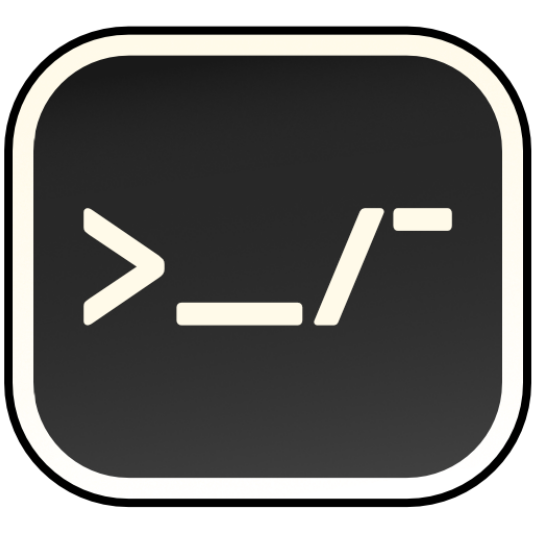

# DevArms

<p align="center">
  
</p>
<p align="center">
Tiny toolkit for developers.
</p>

---

DevArms is a collection of developer utils that gives you extra arms to reach more in your tasks.
It runs completely offline, and cross-platform across Windows, Mac and Linux.
Written in Rust, React. Powered by Tauri.

## Quick Start

Install the built app from [release](https://github.com/qqhann/DevArms/releases) page.
Or you can build it by yourself.

## Contribute

Feature suggestions and bug reports are welcome!
Opening an issue to discuss it before you hand a PR is recommended, but not needed.
To contribute in code, you may follow the following steps.

### App UI - React

The app UI is built with React.
Edit inside `src` and run:

```terminal
yarn lint
yarn start
```

### Core algorithms - Rust wasm

The core algorithms are written in Rust, and served as wasm.
Edit inside `arms` and run:

```terminal
wasm-pack test --firefox --headless
wasm-pack build --target web
```

### App integration - Tauri

The cross platform magic is made possible by Tauri.
Edit inside `src-tauri` if needed, and run:

```terminal
# Open windowed app in development mode
yarn tauri dev
# Build it
yarn tauri build
```

## License

See LICENSE.md
